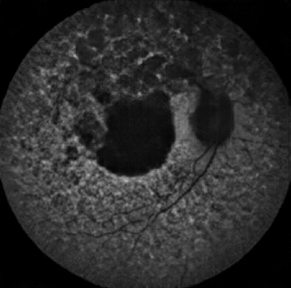

# SynthEye

Inherited Retinal Diseases (IRDs) represent a diverse group of rare monogenic diseases resulting in visual impairment 
and blindness. Over 200 different types of IRDs are known, which affect 1 in 3000 people in the United Kingdom. 
Genetic diagnosis is particularly relevant in IRD management, however remains elusive in more than 40% of cases due to 
the lack of clinical experience and inefficiencies in the diagnostic services.

IRDs have specific progression patterns that can be identified using retinal imaging modalities like 
fundus autofluorescence (FAF), infrared imaging, and optical coherence tomography. The Moorfield's Eye Hospital (MEH) 
IRD cohort contains retinal images and their corresponding genetic diagnoses for more than 3,000 families in the UK. 
An ongoing project pursued by our team, Eye2Gene, uses convolutional neural networks trained on the MEH IRD dataset to 
genetically diagnose up to 36 IRDs. However, there is a high level of class imbalance, due to the rarity of some gene 
classes. To tackle this imbalance, we implement Generative Adversarial Networks (GANs) which can synthesize new images 
of the specific IRDs. As a starting point, we only focus on synthesizing FAF images.

## Models tested

We implemented a conditional version of the Multi-scale gradients GAN (MSGGAN) (see https://github.com/akanimax/BMSG-GAN) 
that can generate images of IRD classes given a noise vector sampled from a multivariate gaussian, and a class encoding. 
We tried 2 ways of providing the class information - a one-hot-vector (CMSGGAN-1) and embeddings (CMSGGAN-2). We also 
experimented with two different losses - Wasserstein loss with Gradient Penality (WGAN-GP) and the Relativistic Average 
Hinge loss (RAHinge).

## Dependencies

Experiments were run in a anaconda virtual environment with Python 3.9.5. The following packages are essential:
- PyTorch == 1.8.1
- Torchvision == 0.2.2 
- NumPy == 1.20.2
- Pandas == 1.2.5
- ScikitLearn == 0.24.2
- SciPy == 1.6.2
- TensorBoard == 2.5.0
- Seaborn == 0.11.1
- MatplotLib ==  3.3.4
- PyYAML == 0.2.5
- tqdm == 4.59.0

Model training used 3 NVIDIA GeForce 3090 RTX GPUs.

## Model Configuration file

The main configuration file for all our experiments is ``model_configs.yaml``. Details of the fields are provided below:

```buildoutcfg
# DATA SETTINGS
data_file: # dataset path - takes a csv file which contains columns for the filepath to image and the label
filenames_col: # column which contains path to image file
labels_col: # column containing label of the image
train_classes: # set to "all" training on all classes, or provide a list/text file of desired classes to train on
transformations:
  resize_dim: # resize image
  random_flip: # performs random flip with p=0.3
  grayscale: # convert image to 1 channel grayscale (if True)
  normalize: # normalizes image across channels

# GAN I/O SETTINGS - Required for either training or testing settings
model: # model name. Can be ["cmsgganv1", "cmsgganv2"]
z_dim: # latent space dimension
output_im_resolution: # resolution you want to generate final images at

# TRAINING SETTINGS
epochs: # number of epochs
loss_fn: # loss function. can be ["wgan-gp", "RAHinge"]
batch_size: # batch size
n_disc_updates: # number of discriminator updates
gen_lr: # learning rate for generator.
disc_lr: # learning rate for discriminator
beta1: # beta1 parameter for Adam optimizer
beta2: # beta2 parameter for Adam optimizer
display_step: # number of steps to visualize outputs during training
calc_fid: # calculate fid during training to check performance? True/False
n_samples_to_generate: # number of samples to visualize in tensorboard during training
save_checkpoint_steps: # saves model checkpoints every N iterations (batch iterations, not epochs!) 
save_tensorboard: # save the tensorboard logging file? True/False
save_weights: # save final weights after training? True/False
parallel: # Run on multiple GPUs? True/False
device_ids: # specify GPU device ids 

# TESTING SETTINGS
weights_dir: # directory of weight/checkpoint files
weights_path: # checkpoint file
gen_classes: # specific "all" to evaluate on all classes, or provide a list/text file of classes to evaluate
n_test_samples: # number of test samples per class
evaluate:
  mutual_information: # compute image similarity between generated set and real dataset
  fid_imagenet: # compute standard FID metric on generated images and real images
  fid_eye2gene: # compute our version of FID using Eye2Gene weights
  class_preds_eye2gene: # compute confusion matrix for Eye2Gene predictions
save_images:
  as_individual: # save indivitual images
  most_similar: # save most similar generated and real image pairs
  most_different: # save most different generated and real image pairs
```
For a sample configuration, look at ``model_configs.yaml``.

## How to train a model

First fill in `# DATASETTINGS`, `# GAN I/O SETTINGS` and `# TRAINING SETTINGS` in the config file.
Then just run ``python train.py``.

## How to generate images

First fill in `# TESTING SETTINGS` in the config file. Note that weights are saved in the `weights/` directory or
`checkpoints/` directory by default. Then just run ``python generate.py``.

## Sample Results from our model

CMSGGAN-1 with RAhinge loss was found to be produce more realistic and biologically correct images. Below is a demonstration
of how the MSGGAN model learns - it starts with learning the lower resolution of the image and then grows to higher resolutions.


Below are some sample images at 256x256 resolution generated by this model for 8 sample IRD genes.


## Interpolation Experiment

Using CMSGGAN-1, we performed an interpolation experiment to explore the GAN latent space. The code for this is in 
``GAN_exploration.ipynb``. First we interpolate images between two classes by holding the noise vector same but 
modifying the class encoding:

**Transforming from *ABCA4* --> *BEST1*:**



Another way to interpolate is between two images in the same class. We do this by interpolating between the 
noise vector but holding the class encoding same. 

**Transforming from z1 *ABCA4* --> z2 *ABCA4*:**


